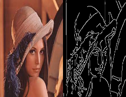
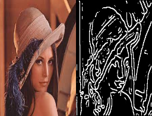
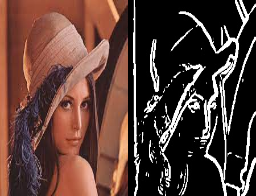

# Edge-Detection

Implementation of the following gradient based edge detectors;

Canny

LOG

A general detector that takes two derivative masks dx and dy as input and use the gradient magnitude along with a suitably chosen threshold to find the edges.

# Functions

## gaussian_blur
It returns a gaussian kernel of a given size and variance.
## gradient_calculation
It returns the gradient and edge direction matrices using Sobel filter.
## non_maximum_suppression
It performs non maximum suppression on the gradient image using edge direction matrix.
## double_thresholding
It separates out weak and strong edges.
## edge_tracking
It converts weak edges surrounded by strong ones into strong edges.
## canny
It performs canny edge detection as follows:
1. Convert rgb image to gray.
2. Apply gaussian blur.
3. Calculate gradient along with edge directions.
4. Perform non maximum suppression on the gradient image.
5. Perform double thresholding on the non maximum suppressed image.
6. Perform edge tracking to convert weak edges surrounded by strong ones into strong edges.
## visualize
It just displays an input image.
## calculate_log
It calculates laplacian of gaussian at a given point according to the provided variance.
## create_log_mask
It returns log mask of given size and variance using calculate_log for each point.
## detect_zero_crossing
It detects zero crossing and uses a threshold to mark an edge.
## threshold
It performs thresholding on the gradient image using a provided threshold.
## general
It performs general detection using two derivative masks provided as input as follows:
1. Convert rgb image to gray.
2. Apply gaussian blur.
3. Calculate the gradient image.
4. Apply threshold on the gradient image.

# Canny

# Log

# General

